We gaan de Maqueen laten voelen en laten doen.

<!--more-->

## Introductie
Voor je de Maqueen aanzet: de Maqueen eerst op de grond zetten!
Hou rekening met de beperkte ruimte: laat het vermogen van de wielen eerst gewoon op 50% staan.

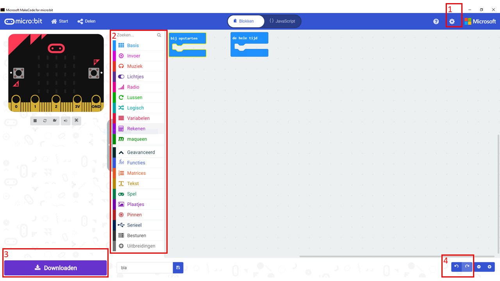

Ook handig om te weten (zie de cijfers in de afbeelding hierboven):
1. Bij de instellingen kun je de taal aanpassen. Deze instructies gaan uit van Nederlandse blokken.
2. Net als bij Scratch staan de blokken per soort bij elkaar. Neem even de tijd om te kijken wat voor blokken er in de verschillende menu's staan. Waar vind je bijvoorbeeld de als... dan... blokken?
3. Met de knop Downloaden zet je je programma op de micro:bit.
4. Als je een fout hebt gemaakt en die wil herstellen dan klik je op het pijltje terug

## De Maqueen met de computer verbinden
1. Start MakeCode.
2. Voeg de Maqueen functies toe aan MakeCode door helemaal onderaan het menu met de blokken op Uitbreidingen te klikken.
3. Plak deze url in de zoekbalk boven in het scherm dat nu verschijnt: https://github.com/MKleinSB/maqueen en klik op het plaatje dat verschijnt.
4. Steek de micro:bit in de Maqueen. De knoppen en LEDjes moeten aan de voorkant zitten.
5. Sluit de micro:bit met de USB-kabel op de computer aan. Je hoeft de Maqueen zelf nog niet aan te zetten.
6. Klik nu op verbinden, begin met de Live stand.
7. Test of de verbinding gelukt is door dit programma te maken en het naar de micro:bit te downloaden:
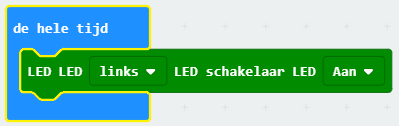
    De LED linksvoor zou nu moeten gaan branden.
8. Je bent nu klaar om een eigen programma te gaan schrijven!

## De input en output van de Maqueen
### Voelen (met de sensoren)
De Maqueen heeft een aantal sensoren om z'n omgeving te voelen.
- _Ultrasoon_: dit zijn de twee 'ogen' voorop de Maqueen. De Maqueen gebruikt net als een vleermuis echo's om voorwerpen te 'zien'. Het ene oog stuurt een geluidje en het andere oog vangt de echo op. De afstand die de sensor meet heet in MakeBlock **Sensor eenheid**.
- _Lijnvolg_: onderop, achter het voorwiel, zitten twee sensoren die het verschil tussen licht en donker kunnen meten. Als de Maqueen over een lijn rijdt kan hij op deze manier zien of er een bocht aankomt. Wat deze sensoren meten heet in MakeBlock **Lees route geleiding**.
- _Infrarood_: voorop, als een soort neusje, zit een infrarood sensor waarmee je de Maqueen bijvoorbeeld met een afstandsbediening kunt besturen.
### Doen (met de actuatoren)
- _Motoren_: ieder wiel wordt met een aparte motor bestuurd.
- _LEDs_: voorop zitten twee rode LEDs, onderop zitten 4 LEDs (NeoPixels) die je iedere kleur kunt maken die je wilt.
- _Buzzer_: net achter de micro:bit zit een buzzer waarmee je de Maqueen allerlei tonen kunt laten maken, en zelfs een beetje laten praten.
Meer over de Maqueen kun je [hier](https://wiki.dfrobot.com/micro:Maqueen_for_micro:bit_SKU:ROB0148-E(ROB0148)#target_7) lezen (in het Engels).

## MakeCode opdrachten

### Voorbeeldopdracht 1: een vierkant rijden
1. De eerste stap is om de Maqueen een stuk vooruit te laten rijden. 100 is een mooie snelheid om mee te beginnen. Laat de Maqueen gaan rijden als je op de linkerknop van de micro:bit drukt. Zet 'm eerst op de grond!



2. Nu rijdt de Maqueen eindeloos door! Zorg dus dat deze na een paar seconden weer stopt met rijden.

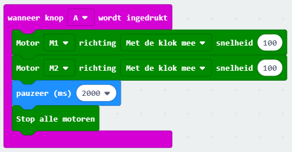

3. Laat nu de Maqueen een bocht maken. Probeer de tijd zo in te stellen dat ie rechtsaf (of linksaf) slaat.

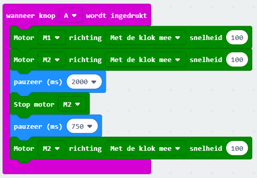

4. Nu wil je meer bochten maken. Probeer daar eens een herhaal-blok voor te gebruiken!

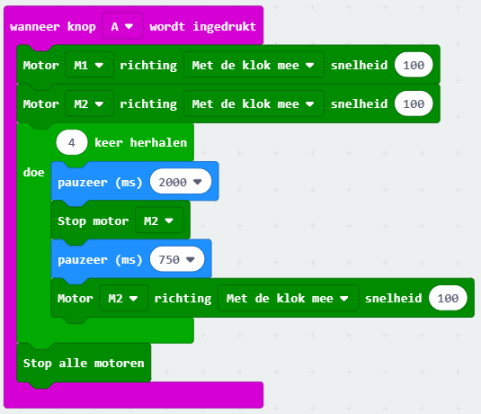


### Voorbeeldopdracht 2: help, een muur!
In deze opdracht is het de bedoeling om te voorkomen dat de Maqueen tegen de muur botst (nadat je 'm er wel naar toe laat rijden natuurlijk).

1. Begin weer met de Maqueen te laten rijden na het indrukken van de knop.



2. Maak nu een voorwaarde waarbij de Maqueen bij een afstand van minder dan 20 centimeter stopt met rijden.

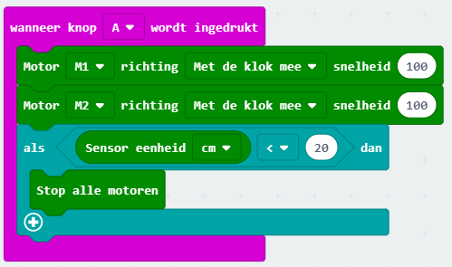

3. Gebeurt er nu wat je wil? Zo niet, denk dan eens na waarom niet? Heb je een stukje code vergeten?

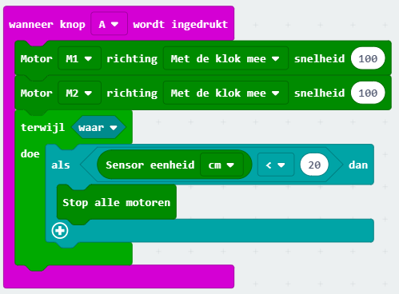


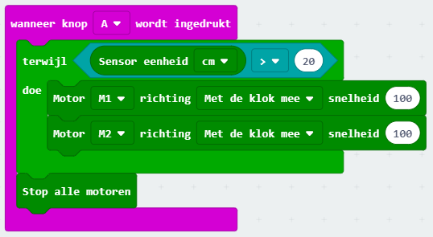

4. Sla maar eens flink alarm met licht en geluid om duidelijk te maken dat de Maqueen bijna gebotst was! Natuurlijk kan dit op veel manieren, de voorbeeldcode is er daar één van.

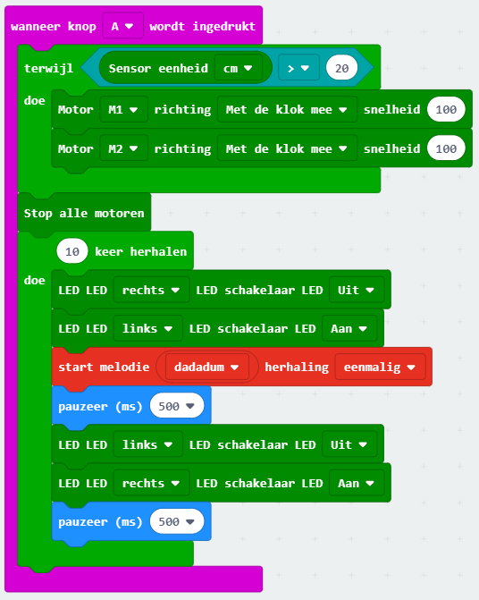


### Voorbeeldopdracht 3: knipperen op de zebra.
In deze opdracht is het de bedoeling dat je de LEDs van de Maqueen aan laat gaan op het moment dat je over zwarte strepen rijdt. Je kunt hiervoor het best zwart tape gebruiken, stiften werken niet zo goed.
1. Begin weer met de Maqueen te laten rijden na het indrukken van de knop.



2. Welke sensor kun je gebruiken om de zwarte strepen te herkennen? En welke waarde heeft de sensor als deze zwart ziet? Hint: je kunt de display van de micro:bit (de 25 LEDs) gebruiken om deze waarde te laten zien.

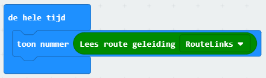

3. Gebruik deze waarde nu in een voorwaarde om de LED aan en uit te laten gaan terwijl je over de strepen rijdt.

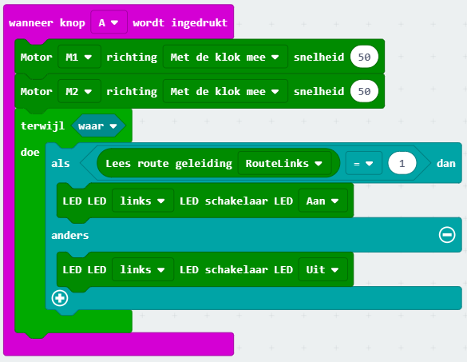


## Uitdagingen
Hier nog een paar uitdagingen waar je aan kunt werken. Ze beginnen makkelijk en worden steeds moeilijker.

Ga zelf aan de gang! Natuurlijk kun je zelf iets verzinnen voor de Maqueen, hier zijn wat ideeën voor als je inspiratie nodig hebt:

- Rijd een achtje (of extra moeilijk: een spiraal)
- Lichten aan in de tunnel
- Aan de slag als politieauto of ambulance
- Volg de lijn
- Ontwijk de voorwerpen
- Volg een voorwerp


