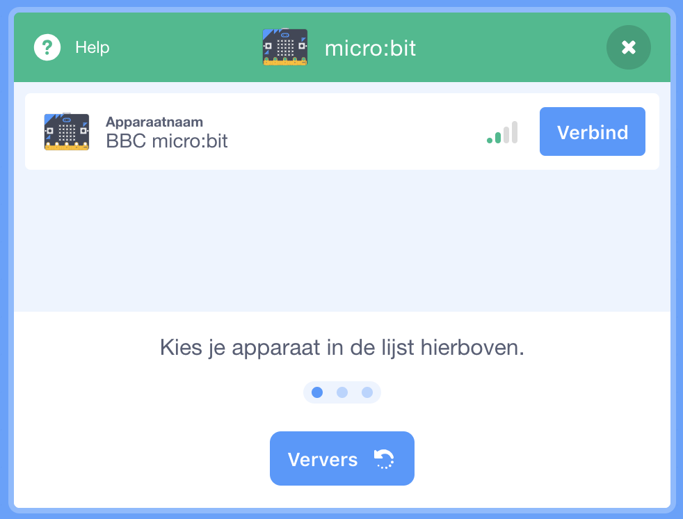
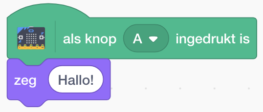
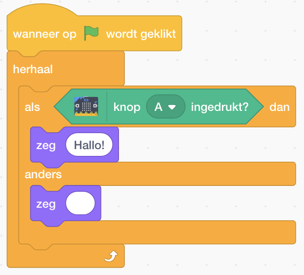

In deze opdracht ga je een figuur uit Scratch laten bewegen met de micro:bit.

<!--more-->

**Let op: dit kan op dit moment alleen als je een computer hebt met Windows 10 of Mac OS 10+ en met Bluetooth 4.0.**

## Voorbereiding

#### Wat heb je nodig:
- een micro:bit

- een USB kabel om de micro:bit aan te sluiten aan de computer

- een batterij om de micro:bit los van de computer te kunnen gebruiken

### Scratch 3 en de micro:bit met elkaar verbinden
Om de micro:bit met Scratch te verbinden moet je twee dingen doen: een programmaatje installeren op je computer en een bestandje naar de micro:bit kopiëren. **Volg de aanwijzingen** op de [Scratch Link](https://scratch.mit.edu/microbit) pagina. Misschien handig: helemaal onderaan de pagina kun je de taal op Nederlands zetten.

## Het programma

### Stap 1: Scratch 3 Beta
Ga naar de [Scratch 3 Beta](https://beta.scratch.mit.edu/) pagina, klik linksonder op het Scratch Extensions icoon  en kies hier de micro:bit extensie. De micro:bit blokken worden nu onderaan toegevoegd en er wordt verbinding gezocht met de micro:bit, dit ziet er zo uit:

### Stap 2: De Scratch kat besturen met de micro:bit

Je bent nu klaar om een spelletje te maken met de micro:bit als controller. Je kunt bijvoorbeeld de Scratch kat (of een ander figuur natuurlijk) laten reageren wanneer je op een knopje drukt, of bijvoorbeeld de micro:bit naar een kant kantelt. Probeer deze blokken maar eens en kijk wat er gebeurt:

Dit is natuurlijk nog niet heel spannend, maar je ziet dat er eigenlijk niet echt verschil is of je nou toetsen op je toetsenbord of de micro:bit gebruikt.

### Stap 3: De besturing wat "slimmer" maken

Bij de blokken in de vorige stap zag je dat de Scratch kat nadat je de "A" knop had ingedrukt de hele tijd "Hallo!" bleef zeggen, en dat je de micro:bit steeds opnieuw naar links moest kantelen om de kat een stukje te laten bewegen. Dat kan handiger, en werkt op dezelfde manier als wanneer je gewoon de knoppen van je toetsenbord gebruikt. Door een *herhaal* te gebruiken samen met een *als ... dan ...* blok te gebruiken kun je steeds controleren of een knop is ingedrukt, de micro:bit wordt gekanteld, enzovoorts. Dan ziet je programma er bijvoorbeeld zo uit:

Je kunt de verschillende *als ... dan ...* blokken natuurlijk ook in hetzelfde *herhaal* blok zetten.

Als je de beweging van je figuur vloeiender wilt maken kun je bijvoorbeeld kijken naar [deze instructies](/instructies/scratch-videosensing/#platform-spel), waarbij je dan de toetsenbordknoppen moet vervangen door knoppen en bewegingen van de micro:bit. Je kunt ook spelen met kantelen naar voren en achteren, of schudden met de micro:bit.

### Stap 4: Een spelletje bouwen

Nu je de Scratch kat kunt laten bewegen met de micro:bit kun je hier een spelletje omheen bedenken. Heb je zelf geen ideeën? Vraag de mentoren of kijk eens hier:

* [Onze andere Micro:Bit opdrachten](/instructies/microbit/)
* [Scratch projecten](https://scratch.mit.edu) en zoek bijvoorbeeld op 'platform' of 'vliegen' (waarschijnlijk werkt dit alleen in Google Chrome)
* [Google Drive van CoderDojo Zoetermeer](https://drive.google.com/drive/folders/0B-NwRJ9NsROUbnByYlgyOHgxUFE) met opdrachten op verschillende niveau's.

Let op: deze opdrachten zijn wel voor Scratch 2 geschreven, als je daardoor dingen niet kunt vinden of niet snapt in Scratch 3 laat het de mentoren weten!


