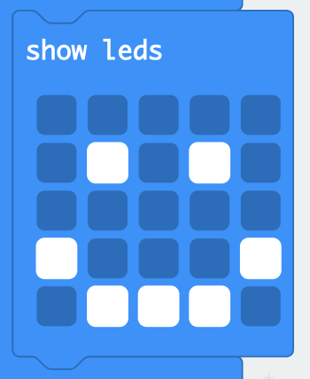
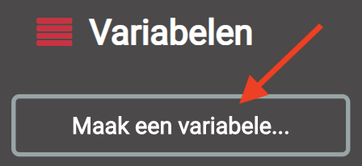
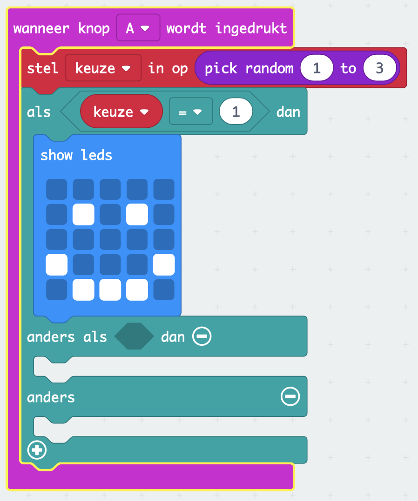
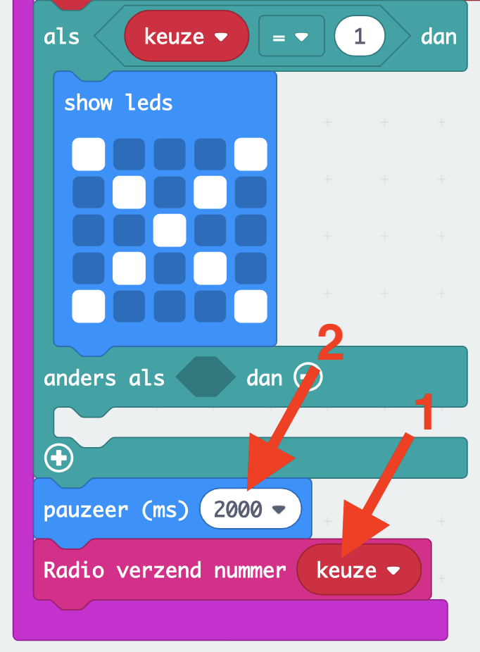
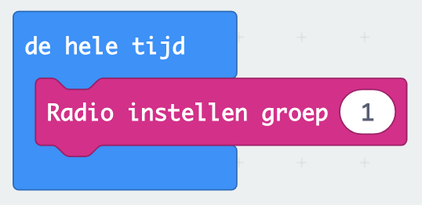
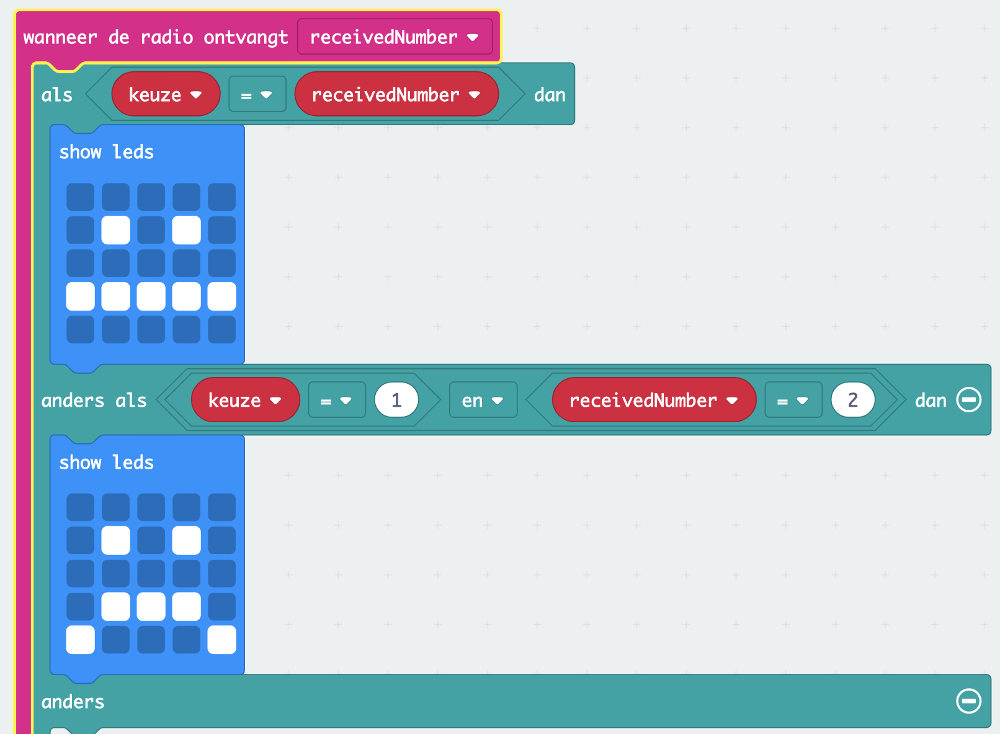
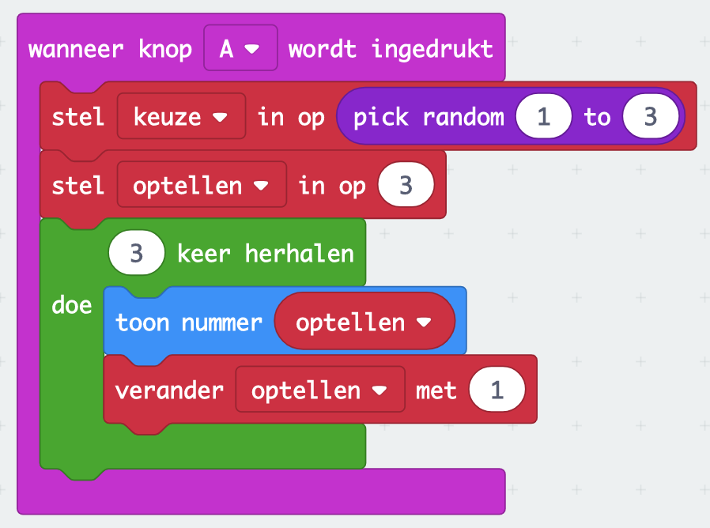

In deze opdracht ga je het spelletje steen-papier-schaar programmeren op de micro:bit, en dit spelen tegen iemand anders.

<!--more-->

## Voorbereiding

#### Wat heb je nodig:
- een micro:bit (of twee)
- een USB kabel om de micro:bit aan te sluiten aan de computer
- een batterij om de micro:bit los van de computer te kunnen gebruiken

## Het programma

### Stap 1: steen, papier en schaar tekenen

Bij dit programma maken we gebruik van de LEDjes op de micro:bit. Hier kun je allerlei figuren op maken, teken nu eerst een steen, vel papier en een schaar.

### Stap 2: een keuze maken

De micro:bit gaat een van de drie kiezen. Hiervoor moet je een paar dingen programmeren.

1. Eerst heb je het blok _pick random 0 to 10_ voor nodig, dit vind je in het menu _Wiskunde_. Stel het blok  zo in dat het drie getallen kan kiezen, namelijk 1, 2 of 3:

2. Maak nu een _variabele_ aan om het gekozen getal een naam te geven en later weer te kunnen gebruiken. Noem het bijvoorbeeld "keuze":

3. Geef nu deze variabele de waarde van het gekozen getal, en laat de micro:bit deze opdracht uitvoeren als je op de A knop van de micro:bit drukt:

### Stap 3: het gekozen plaatje laten zien

Je hebt nu een variabele _keuze_ die het cijfer 1, 2 of 3 kan zijn, en drie plaatjes. Nu moet elk van de keuzes een ander plaatje laten zien: 1 = steen, 2 = papier en 3 = schaar.

Gebruik hiervoor het blok _als ... dan ..._ blok en het _... = ..._ blok uit het menu _Logisch_:

Als je het programma hierboven uitvoert laat de micro:bit alleen een plaatje zien als _keuze_ 1 is, voeg daarom nu ook de andere twee plaatjes toe.

Als iemand anders nu ook het steen-papier-schaar programma op een micro:bit zet dan kun je het tegen elkaar spelen! 

### Stap 4: een bericht sturen en ontvangen

Als je nog tijd over hebt en het programma nog verder wilt uitbreiden dan kun je proberen de micro:bits met elkaar te laten praten. Als de micro:bits hun keuze naar elkaar sturen kunnen ze de keuzes vergelijken en zelf ook zien wie er gewonnen heeft.

Micro:bits praten met elkaar via de _radio_. Ze kunnen bijvoorbeeld woorden of getallen naar elkaar sturen, en je kunt de micro:bit programmeren om een opdracht uit te voeren bij het ontvangen van een bericht.

Bij steen-papier-schaar sturen de micro:bits de waarde van _keuze_ naar elkaar toe (pijl 1). Wacht voor je je keuze naar de andere micro:bit stuur eerst even (pijl 2), anders verdwijnt je plaatje meteen weer:

Om een bericht te kunnen ontvangen moeten micro:bits op hetzelfde _kanaal_ sturen en ontvangen (net als bijvoorbeeld bij een walkie-talkie):

### Stap 5: de winnaar bekend maken

De micro:bit kan nu de keuze van de ander ontvangen, maar doet er nog niks mee. Om de eigen keuze met die van de andere te vergelijken om te kijken wie er gewonnen heeft gebruik je weer een _als ... dan ..._ blok uit het menu _Logisch_, waarbij er natuurlijk een boel verschillende combinaties zijn!

- Speler 1 heeft steen en speler 2 ook: gelijkspel!
- Speler 1 heeft steen en speler 2 heeft schaar: speler 1 wint!
- Speler 1 heeft steen en speler 2 heeft papier: speler 2 wint!
- Enzovoorts

In het voorbeeld hieronder zie je dat je moet kijken naar het _receivedNumber_, het ontvangen nummer dus de keuze van de andere micro:bit.

 Er zijn alvast twee gevallen geprogrammeerd:

- dat waarbij de micro:bits allebei **dezelfde keus** maakten: dan is "keuze" gelijk aan _receivedNumber_
- dat waarbij de eigen keuze **steen** was (getal 1) en dat van de ander **papier** (getal 2). Deze micro:bit heeft dan dus verloren.

Programmeer nu zelf de rest van de mogelijkheden.

### Stap 6: tot drie tellen voor je het plaatje laat zien

Om het nog even spannend te houden kun je de micro:bit eerst nog tot drie laten tellen voor je de keuze laat zien. Hier heb je een _x keer herhalen_ blok voor nodig uit het menu _Lussen_ en het _toon nummer_ blok uit het menu _Basis_:


 