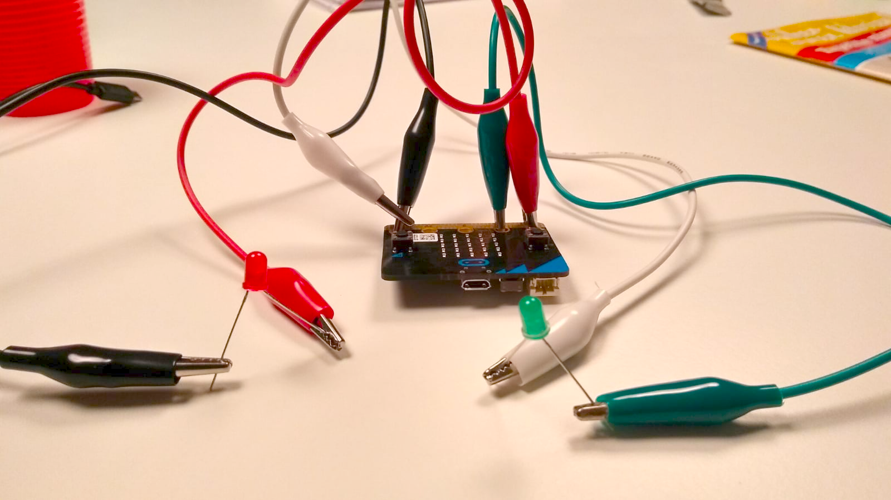
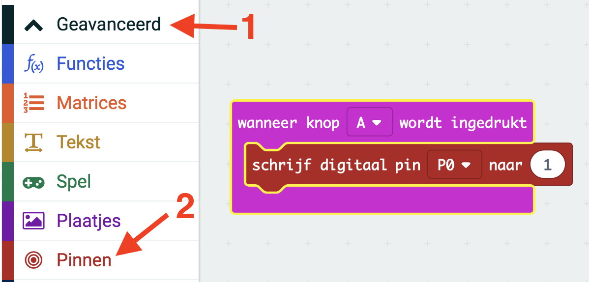
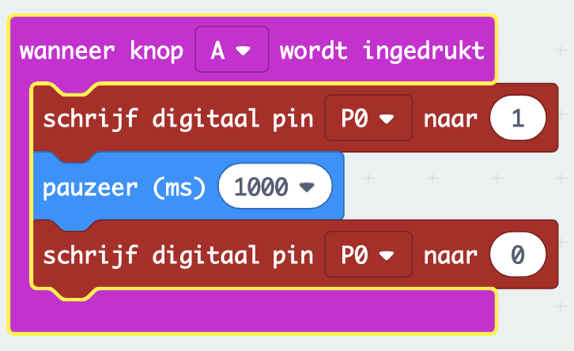
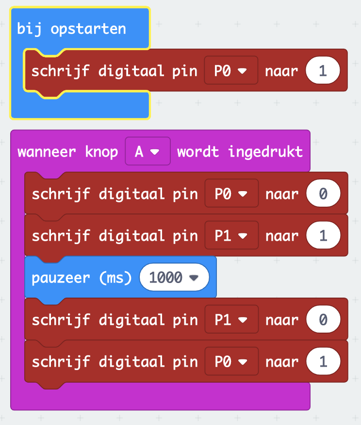
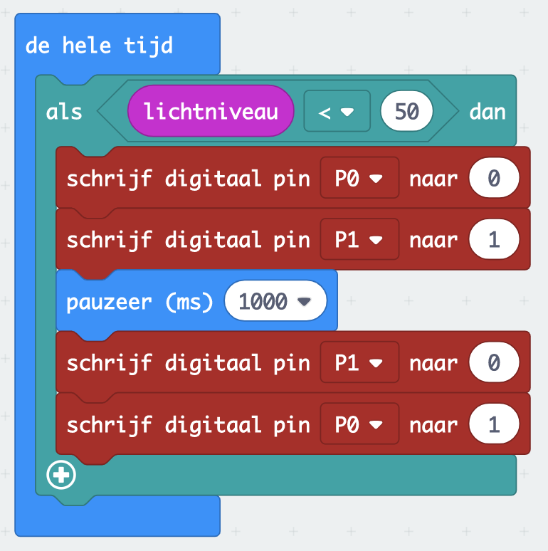

In deze opdracht ga je een stoplicht maken.
<!--more-->
Het stoplicht heeft twee kleuren: groen en rood. Normaal staat het stoplicht op rood. Als je op een knopje drukt springt het op groen, en na een tijdje weer op rood. Als dit gelukt is kun je het programma zo aanpassen dat het stoplicht op groen springt als er een auto over de micro:bit heen "rijdt", bijvoorbeeld door je hand erboven te houden.

## Voorbereiding

#### Wat heb je nodig:
- een micro:bit
- een USB kabel om de micro:bit aan te sluiten aan de computer
- een rode en een groene LED
- vier "krokodillenbekken"

### Alles aansluiten
Net als batterijen hebben LED lampjes een plus en een min. Als je goed kijkt zijn de pootjes van de LED's niet even lang: het net iets *langere pootje is de plus*, de kortere de min. Gebruik de krokodillenbekken om de plussen van de rode en groene LED vast te maken op aansluitingen Pin 0 en Pin 1 van de micro:bit, en de minnen aan de GND (je kunt de eerste krokodillenbek aan GND vastmaken en de tweede aan de eerste). Het zou er dan ongeveer zo uit moeten zien:

## Het programma

### Stap 1: Een LED aanzetten
Om een LED aan te zetten moet je stroom laten lopen van de plus-aansluiting door de LED naar de min. Dit doe je met het blok _schrijf digitaal pin \<P0\> naar 0_. Dit vind je door op _Geavanceerd_ (zie pijl 1) te klikken en daarna op _Pinnen_ (pijl 2), zie het plaatje hieronder. Laat de LED aan gaan wanneer je op knop A drukt.

### Stap 2: De LED weer uit laten gaan
Je hebt er weinig aan als de LED de hele tijd aan blijft. Deze moet dus na een tijdje weer uit. Wacht na het aanzetten bijvoorbeeld een seconde (1000 ms) en zet de LED dan weer uit door Pin 0 weer op 0 te zetten:

### Stap 3: Het stoplicht staat op rood, tot je op de knop drukt
Nu is het tijd om allebei de LEDs te gebruiken: de rode moet eigenlijk altijd aan zijn, behalve wanneer op knop A wordt gedrukt. Dit doe je door bij het opstarten de rode LED al aan te zetten, en deze uit te zetten op het moment dat de groene LED aan gaat:

### Stap 4: de knop vervangen door een “auto”
Als extra uitdaging kun je nu het indrukken van knop A vervangen door wat er gebeurt als de micro:bit in het donker terecht komt doordat er een auto overheen rijdt. Hiervoor heb je het blok _lichtniveau_ uit het menu _Invoer_ nodig, en moet je kijken hoeveel licht (een getal tussen 0=helemaal donker en 255=heel licht) de micro:bit ziet als je er bijvoorbeeld je hand boven houdt. Deze waarde kun je dan gebruiken als voorwaarde om het stoplicht op groen te laten springen. Om een programma met deze voorwaarde te maken heb je ook blokken uit het menu _Logisch_ nodig: het _als waar dan ..._ blok en het _... < ..._ blok. En je moet ervoor zorgen dat je programma de hele tijd kijkt of de voorwaarde waar is of niet. Uiteindelijk moet het er dan ongeveer zo uitzien:


